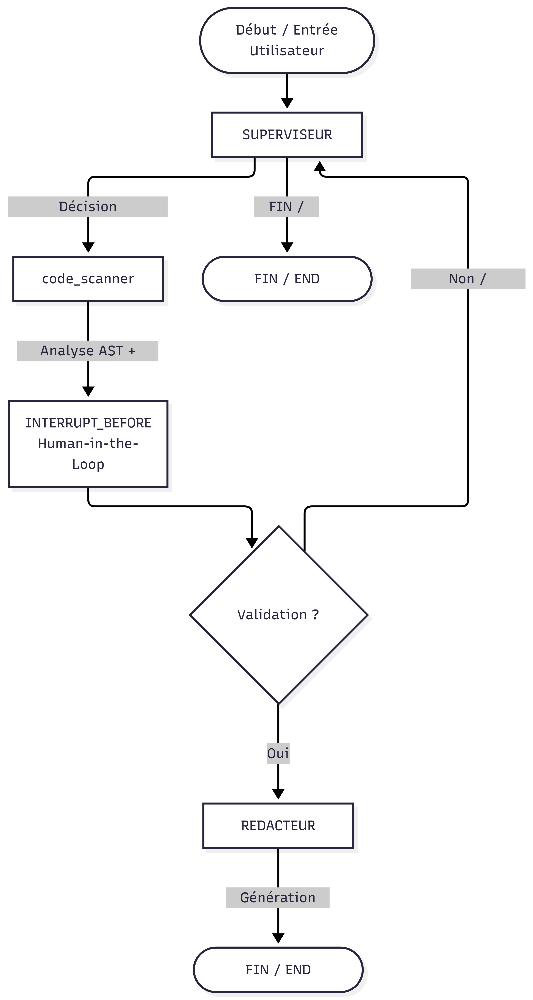

# Sprint 2 — Système Multi-Agents avec LangGraph (Superviseur & Mémoire)

Suite du Sprint 1 (DevOps Assistant). Ce sprint implémente un système
multi-agents orchestré par un **Superviseur**, avec **mémoire d'état
persistante** (checkpointer), **routage conditionnel**, **Human-in-the-loop**
et **traçage LangSmith**.

## Architecture

```
agentic-doc-pipeline/
├── src/
│   ├── state.py              # AgentState (TypedDict + add_messages)
│   ├── config.py              # Settings (pydantic-settings) + LangSmith
│   ├── llm.py                  # Factory ChatGroq + retry/backoff (tenacity)
│   ├── graph.py                # StateGraph : nœuds, arêtes conditionnelles, interrupt_before
│   ├── agents/
│   │   ├── supervisor.py       # Routage via sortie structurée (Pydantic)
│   │   ├── code_scanner.py     # Analyse AST + interprétation LLM
│   │   └── redacteur.py        # Rédaction finale (après validation humaine)
│   ├── tools/
│   │   └── code_analysis_tools.py  # Outil @tool : analyse AST déterministe
│   └── api/
│       ├── main.py             # FastAPI : /chat, /chat/resume, /chat/state
│       └── schemas.py
├── scripts/run_cli.py          # CLI interactif (test local sans API)
├── tests/                      # pytest (LLM mocké, pas d'appel réseau)
├── docker/                     # Dockerfile + docker-compose (app + Postgres)
├── .github/workflows/ci.yml    # CI GitHub Actions (pytest)
└── .env.example
```

## Flux du graphe

<p align="center">
  
</p>

Le **Superviseur** ré-évalue l'état après chaque agent spécialisé (boucle),
et décide via une sortie structurée (`RouteDecision`, Pydantic) : c'est plus
fiable qu'un parsing de texte libre et ça reste observable dans LangSmith
comme un tool call typé.

### Human-in-the-loop

Le graphe est compilé avec `interrupt_before=["redacteur"]` : l'exécution se
**fige automatiquement** juste avant la rédaction finale. Un humain doit
valider (et peut corriger `scan_result`) via `POST /chat/resume` pour que
l'exécution reprenne depuis le checkpoint.

### Mémoire / Checkpointer

- `CHECKPOINTER_BACKEND=memory` (par défaut) : `MemorySaver`, non persistant,
  pratique en dev/CI.
- `CHECKPOINTER_BACKEND=postgres` : `PostgresSaver`, état persistant entre
  redémarrages (utilisé par `docker-compose.yml`).

Le `thread_id` identifie une conversation : tout l'état (`messages`,
`scan_result`, `final_documentation`, etc.) est rattaché à ce fil et
récupérable via `GET /chat/state/{thread_id}`.

## Installation

```bash
python -m venv .venv && source .venv/bin/activate
pip install -r requirements.txt
cp .env.example .env   # renseigner GROQ_API_KEY et LANGCHAIN_API_KEY
```

## Observabilité (LangSmith)

Dans `.env` :

```
LANGCHAIN_TRACING_V2=true
LANGCHAIN_API_KEY=lsv2_...
LANGCHAIN_PROJECT=sprint2-multi-agent-system
```

Chaque exécution (superviseur, code_scanner, redacteur, appels LLM) apparaît
comme une trace hiérarchique sur https://smith.langchain.com, avec latence,
tokens et arbre d'appel complet — utile pour déboguer le routage du
Superviseur.

## Utilisation

### CLI (local, sans serveur)

```bash
python scripts/run_cli.py
```

### API

```bash
uvicorn src.api.main:app --reload
```

```bash
# 1. Lancer une demande (avec code à analyser)
curl -X POST localhost:8000/chat \
  -H "x-api-key: change-me-in-prod" -H "Content-Type: application/json" \
  -d '{"thread_id":"demo-1","message":"Analyse ce code puis documente-le","code_input":"def f(x):\n    return x\n"}'
# -> status: "interrupted" (attend validation humaine)

# 2. Valider et lancer la rédaction finale
curl -X POST localhost:8000/chat/resume \
  -H "x-api-key: change-me-in-prod" -H "Content-Type: application/json" \
  -d '{"thread_id":"demo-1","approved":true}'
# -> status: "completed", final_documentation rempli

# 3. Consulter l'état à tout moment
curl localhost:8000/chat/state/demo-1 -H "x-api-key: change-me-in-prod"
```

### Docker (avec checkpointer Postgres)

```bash
docker compose -f docker/docker-compose.yml up --build
```

## Tests

```bash
pytest -v
```

Les tests mockent les LLM (`FakeStructuredLLM`, `FakeChatLLM`) : aucun appel
réseau à Groq, exécution rapide et déterministe, adaptée à la CI.

## Pistes d'évolution (niveau avancé +)

- Remplacer le routage superviseur par une réplanification dynamique
  (cf. pattern SentriMesh) si un agent échoue ou renvoie un résultat
  contradictoire, au lieu de simplement boucler.
- Ajouter un agent "Reviewer" entre `code_scanner` et `redacteur` qui
  valide la cohérence du `scan_result` avant la rédaction (2ᵉ garde-fou
  automatique en plus du Human-in-the-loop).
- Exposer un endpoint SSE (`/chat/stream`) pour streamer les étapes du
  graphe en direct côté client, sur le modèle du Sprint 1.
- Basculer les outils custom (`analyze_code_structure`) vers une couche
  MCP, comme évoqué pour les projets précédents.
